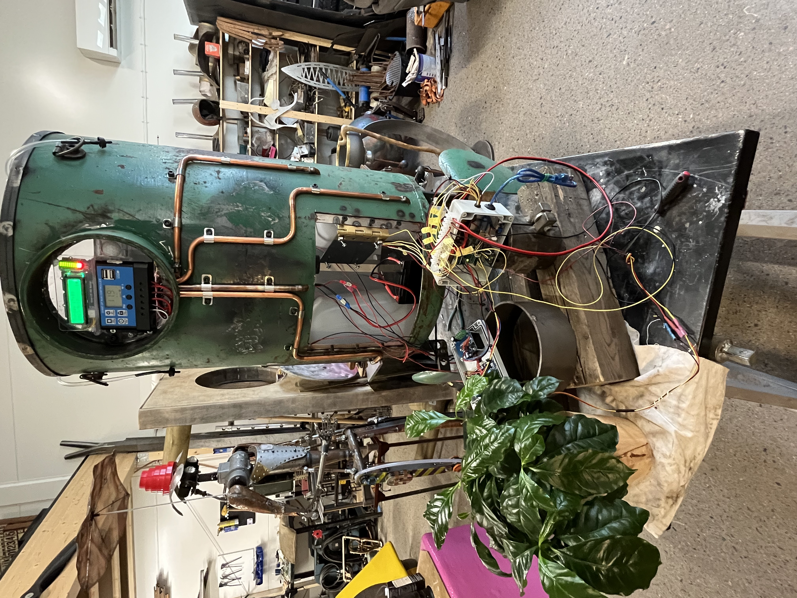
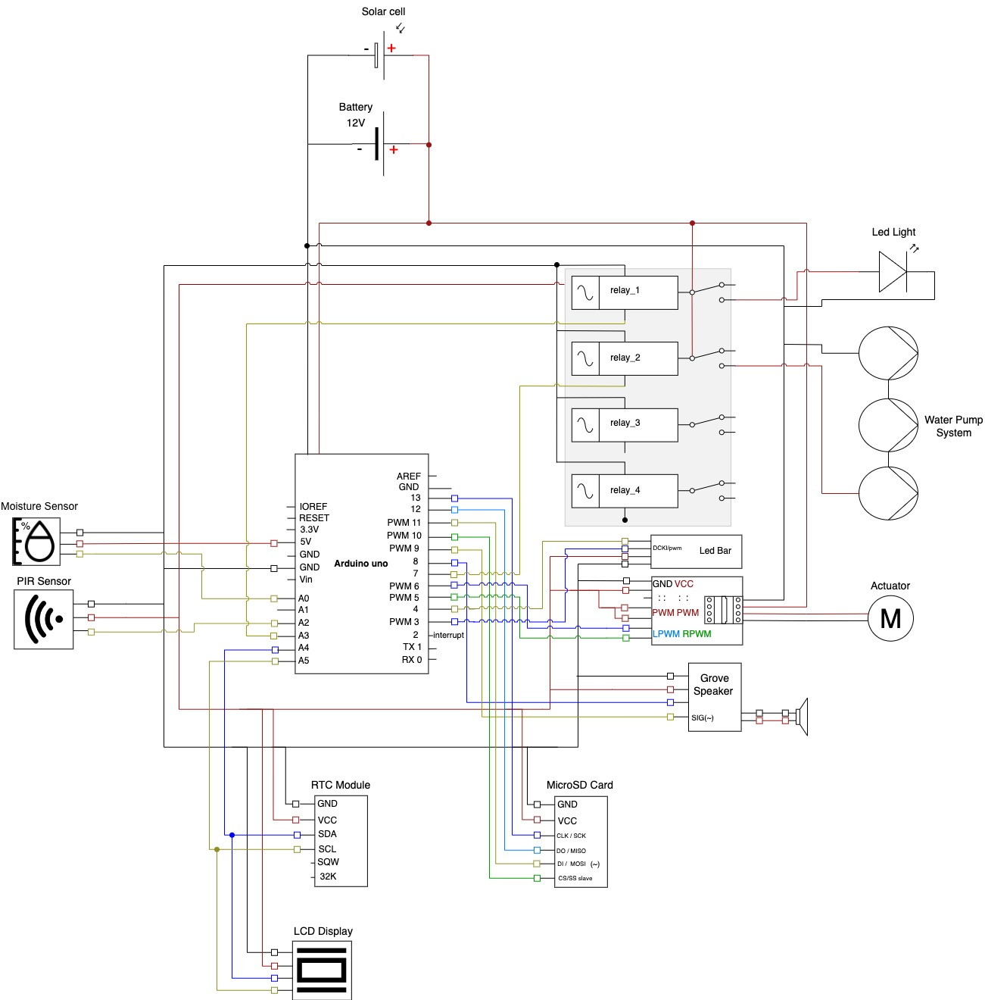

  

# Grow-bot: Solar-Powered Plant Care Art Installation with Arduino

### A blend of art and technology, powered by Arduino, created for collaborative art installations and environmental art projects.

This project is a collaboration with the artist Johnny Persson.

## Table of Contents
1. [Project Description](#project-description)
2. [Project Diagram](#project-diagram)
3. [Components List](#components-list)
4. [Resources](#resources)
   - [Arduino Datasheets](#arduino-datasheets)
   - [Component Datasheets](#component-datasheets)

## Project Description
This project implements a solar-powered plant care system using an Arduino microcontroller. The Grow-bot integrates soil moisture, light, and temperature/humidity sensors to monitor plant health, controlling a water pump for automated irrigation. The system features a solar panel for energy self-sufficiency and a rainwater collection mechanism for sustainable water storage. An OLED display showcases real-time sensor data with artistic visualizations, enhancing the system’s aesthetic appeal. The project demonstrates efficient use of Arduino’s GPIO and I2C interfaces for sensor integration and pump control, with custom firmware to manage watering schedules and display outputs, creating a functional art installation that nurtures plants autonomously.

## Project Diagram

### Components List
| Component       | Type                 | Amount |
|-----------------|----------------------|--------|
| LCD             | Grove - 16x2 LCD     | 1      |
| RTC             | DS3231               | 1      |
| PIR Sensor      | Motion Sensor        | 1      |
| Moisture sensor | Capacitive           | 4      |
| Relay           | 5V 4 Channel         | 1      |
| Motor driver    | H-bridge BTS7960     | 1      |
| LED             | Multi color strip    | 1      |
| LED Bar         | Grove - LED Bar      | 1      |
| Speaker         | Grove - Speaker Plus | 1      |
| MicroSD         | 1GB                  | 1      |
| Solar cell      | Flexible 200W        | 1      |
| Actuator        | Electric linear      | 1      |
| Water pump      | 12V                  | 4      |
| Battery         | 12V                  | 2      |

 

## Resources

### Arduino Datasheets
- [Arduino Datasheet](https://docs.arduino.cc/resources/datasheets/A000066-datasheet.pdf)

### Component Datasheets
- [PIR Sensor Datasheet](https://cdn-learn.adafruit.com/downloads/pdf/pir-passive-infrared-proximity-motion-sensor.pdf)
- [Grove - 16x2 LCD](https://wiki.seeedstudio.com/Grove-16x2_LCD_Series/)
- [Grove - LED Bar](https://wiki.seeedstudio.com/Grove-LED_Bar/)
- [Grove - Speaker Plus](https://wiki.seeedstudio.com/Grove-Speaker-Plus/)
- [RTC DS3231](https://www.datasheethub.com/ds3231-precision-i2c-real-time-clock-module/)
- [Motor driver BTS7960](https://www.handsontec.com/dataspecs/module/BTS7960%20Motor%20Driver.pdf)

